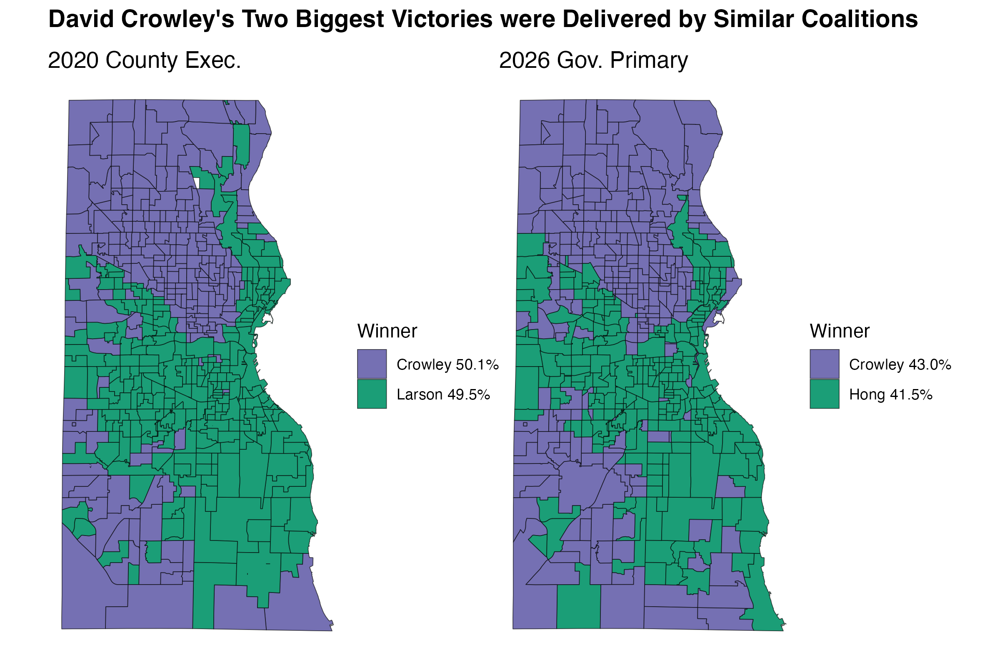
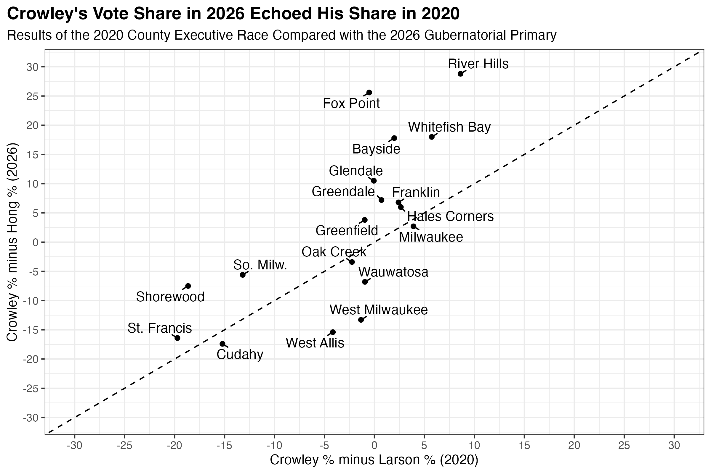

Talk about a come-from-behind victory. David Crowley's roughly 3,200-vote, 0.4-point victory in the Wisconsin Democratic primary came after every public poll—and Crowley's own internal survey—showed him trailing Francesca Hong by double digits in the weeks preceding the election. The late-July Marquette poll, for instance, showed Hong drawing the support of 38%, followed by 16% for Mandela Barnes and 7% for Crowley. Thirty-four percent remained undecided in that poll.

Those undecided voters apparently broke heavily for Crowley, following Barnes's exit from the race and high-profile endorsements from politicians like Congresswoman Gwen Moore. He wound up winning the race with roughly 39.8% of the vote to Hong's 39.4%.

It took Milwaukee's "ballot dump"—separately tallied absentee votes added in the wee hours of Wednesday morning—to seal Crowley's 2026 victory. But Crowley did not win his home county by an overwhelming margin. Here, he won 43.0% to Hong's 41.5%, a considerably smaller margin of victory than he achieved in any of Milwaukee's neighboring counties.

Crowley is no stranger to close races like this one. He won his current office, Milwaukee County Executive, by an almost equally slim margin in 2020, when he defeated State Senator Chris Larson by 0.6 points and just over 1,000 votes.

More than just a narrow margin of victory connects Crowley's 2020 and 2026 campaigns. Consider the following two maps, which show how Crowley fared across each Milwaukee County ward in those two elections.

In both campaigns, Crowley (a moderate Democrat) faced off against a progressive challenger running clearly to his left. In 2020, this challenger was State Senator Chris Larson, whose district covers the east side of Milwaukee. In 2026, his main opponent, Francesca Hong, was a member of the Democratic Socialists of America (and endorsed by Larson).

To a remarkable degree, Hong and Larson won similar parts of Milwaukee County in their respective campaigns against Crowley.

Within the city, Crowley's significant sources of votes in either election were the majority Black north side along with some of the more conservative, majority white neighborhoods on the city's western fringe. Hong and Larson won everywhere else, with particular strength in the liberal strongholds between I-43 and Lake Michigan. This progressive strength also extended into adjacent suburbs including St. Francis, Shorewood, Cudahy, and South Milwaukee—all places where Crowley trailed both Hong and Larson.

However, Crowley handily won a different set of suburbs. On the north shore, he carried River Hills, Bayside, and Brown Deer. To the southwest, he won Greenfield, Greendale, Franklin, and Hales Corners. His support grew the most on the north shore between these two elections. For example, he ever-so-slightly lost Fox Point to Larson in 2020, but he defeated Hong in that wealthy suburb by more than 25 points.

In other words, Crowley reliably draws support from a seemingly contradictory set of places. In Milwaukee County, he wins the poorest wards and the richest, the most Black and the most white, the most Democratic and the most Republican.

This coalition has served Crowley well in campaigns against challengers to his left. Now, for the first time in his career, he will need to test his political skills against a Republican opponent.

## Bonus map

Wisconsin's elections are independently administered by each of its 72 counties. This means that there isn't an official source for statewide ward-level election returns until the state Elections Commission collects and certifies them several weeks after the election. In the meantime, it is my custom to collect and standardize ward results from as many counties as practical. [Here is a link to an interactive map](https://law.marquette.edu/assets/community/lubar/assets/aug2026/gov.html) containing the ward results I've gathered so far for the Democratic primary. Save the link; as I add more counties, the map will automatically display that data.
